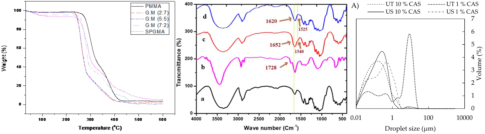
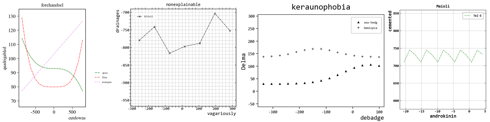
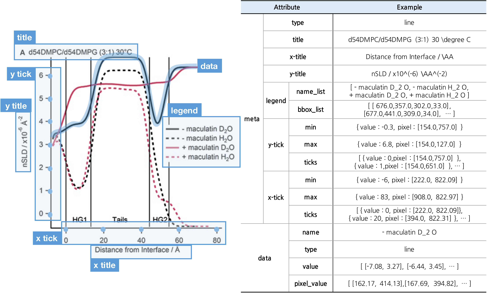
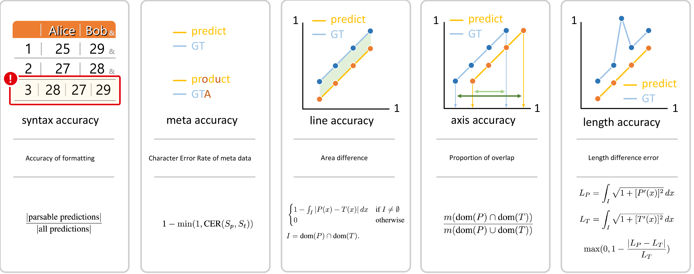
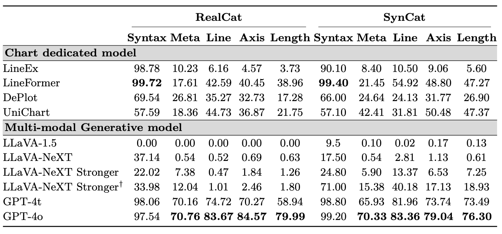

## SciCat: Scientific Chart De-rendering Benchmarks

<p align="center">
 
</p>

<div align=center>


</div>


## 📝 News
<!-- - **[2025/03]** We have released the benchmark metric CAMP. -->
- **[2025/03]** We have opened a [**parser zoo**](https://github.com/annonymousAI/scicat/tree/main/parser_zoo) for the convenience of training and evaluation.
- **[2025/03]** [**CAMP 2.0**](https://github.com/annonymousAI/scicat/blob/main/eval/camp.py) is released. The readability of the code has been improved.
- **[2025/03]** We have released the dataset [**SynCat**](https://drive.google.com/file/d/1PwJ1ahfOOVy-71dVZ-ZKF5bU8XoMYjvw/view?usp=drive_link) and [**RealCat**](https://drive.google.com/file/d/1K9zpVGvX73Qqsu33v0kfXq1_RLBCCkky/view?usp=sharing).

<!-- ## TL;DR -->

## 🔎 Introduction
**Chart de-rendering** is the task of extracting raw data from chart images and is vital for database construction and enhancing data accessibility, integrity, and usability.  

<p align="center">
 
</p>

To address this, we present `SciCat`, a new benchmark for scientific chart de-rendering, which consists of two datasets, `RealCat` and `SynCat`, and a new measure, `CAMP`.

## 🐱 What is SciCat ?

SciCat consists of:
- `🧑‍🔬RealCat`, a chart dataset from scientific papers;
- `🤖SynCat`, a synthetically generated chart dataset; and
- `⛺️CAMP`, evaluation metrics for chart de-rendering.

🧑‍🔬 **RealCat:** Real Chart

<p align="center">
 
</p>

> This dataset is suitable for testing purposes. Download [here](https://drive.google.com/file/d/1K9zpVGvX73Qqsu33v0kfXq1_RLBCCkky/view?usp=sharing).

`RealCat` dataset comprises 1,000 chart images extracted from chemical open journals, comprising 741 line charts, 220 scatter charts, and 39 charts combining line and scatter elements.

We first gathered PDFs from six distinct open-access scientific journals: Biomedical Central Chemistry, three jorunals from MDPI (Catalysts, Polymers, Molecules), Frontiers in Chemistry and PLOS ONE Chemistry.
Despite being open journals, each paper can have its own license, so we filtered the PDFs to include only those with a Creative Commons CC-BY license or equivalent. 

🤖 **SynCat:** Synthetic Chart
<p align="center">
 
</p>

> This dataset is suitable for training purposes. Download [here](https://drive.google.com/file/d/1PwJ1ahfOOVy-71dVZ-ZKF5bU8XoMYjvw/view?usp=drive_link).

`SynCat` consists of 50,000 training images and 5,000 evaluation images. The dataset includes a variety of styles and realistic chart data that can be found in scientific literature. The functions used include random, polynomial, periodic, and Gaussian, among others, which can be further expanded.

To get the SynCat generation code, please contact us by email.

<!-- We have also uploaded the `SynCat` generation code. -->

**Annotation Format**   
Both SynCat and RealCat follow the following annotation format. `data` > `name` is structured as a list type to represent entities with multiple names.
<p align="center">
 
</p>

If you'd like to see more examples from SciCat, click [here](https://github.com/annonymousAI/scicat/tree/main/comparison).

> [!NOTE]
> For `["meta"]["type"]`, each chart image is annotated with a 1 for elements it contains and a 0 for elements it does not, from the following list: `[line, bar, scatter, trendline, waveform, spectrum]`.


## ⛺️ What is CAMP ? 

**C**hart **A**ccuracy **M**easurement **P**rotocol (**CAMP**), is designed to analyze five key measures (`Syntax`, `Meta`, `Line`, `Axis`, `Length`).

<p align="center">
 
</p>

- **Syntax accuracy** : Cases where data cannot be parsed, such as mismatched rows and columns, are considered syntax errors.
- **Meta accuracy** : The accuracy of extracting meta-information is measured using Character Error Rate (CER).
- **Line accuracy**: The gap between the predicted line and the ground truth line is measured by area.
- **Axis accuracy**: Measures how closely the predicted x-axis range matches the ground truth.
- **Length accuracy** : Compares the length of the line to measure the frequency of outliers.

Below, we provide a general guideline for evaluating the output of a chart de-rendering model with `camp.py`.

```bash
python camp.py --pred {path/to/pred.json} --gt {path/to/gt.json}
```

If you'd like to see examples of CAMP, click [here](https://github.com/annonymousAI/scicat/tree/main/camp_visualize).

## 🧗 Overview of benchmark

### SciCat Benchmark
<p align="center">
 
</p>


## 🤝 License
This project is released under a [![CC BY-NC-SA 4.0][cc-by-nc-sa-shield]][cc-by-nc-sa]

[cc-by-nc-sa]: http://creativecommons.org/licenses/by-nc-sa/4.0/
[cc-by-nc-sa-image]: https://licensebuttons.net/l/by-nc-sa/4.0/88x31.png
[cc-by-nc-sa-shield]: https://img.shields.io/badge/License-CC%20BY--NC--SA%204.0-lightgrey.svg


<!-- 
## Contents
- [1. Benchmark Data and Evaluation Tool](2. #1-benchmark-data-and-evaluation-tool)
- [Download UNA dataset](#2-install)
- [3. Demo](#3-demo)
- [4. Train](#4-train) -->
