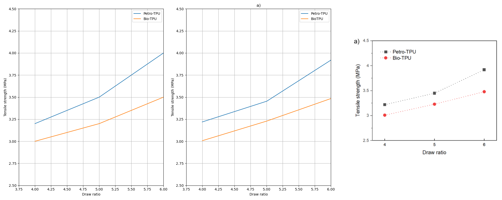

# Visualizing CAMP

This page provides visualizations of line tracing ability (i.e., line, axis, and length accuracy) to enhance understanding of CAMP.

The images below are arranged in the following order from left to right:
1. GPT4-o Model Prediction
2. Ground Truth Reconstruction
3. Original Image

### Line acc. Under 50

| **line :** 38.45 | **axis :** 51.18 | **length :** 51.18 |

 

| **line :** 41.51 | **axis :** 85.47 | **length :** 0.00 |

 

### Line acc. 60~70

| **line :** 65.18 | **axis :** 85.00 | **length :** 90.49 |

 

| **line :** 69.22  | **axis :** 68.03 | **length :** 61.13 |

 

### Line acc. 70~80

| **line :** 71.27  | **axis :** 65.56 | **length :** 70.69 |

 

| **line :** 79.46  | **axis :** 95.06 | **length :** 84.85 |

 

### Line acc. 80~90

| **line :** 82.99  | **axis :** 100.00 | **length :** 65.33 |

 

| **line :** 89.58  | **axis :** 94.73 | **length :** 7.61 |

 

> We can observe that errors not captured by line accuracy alone are revealed in length accuracy.

### Line acc. 90~

| **line :** 98.06  | **axis :** 99.82 | **length :** 99.18 |

 

| **line :** 98.73 | **axis :** 99.89 | **length :** 98.82 |

 

