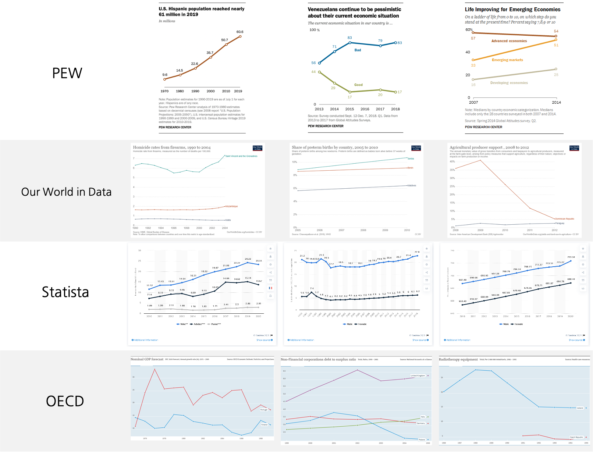
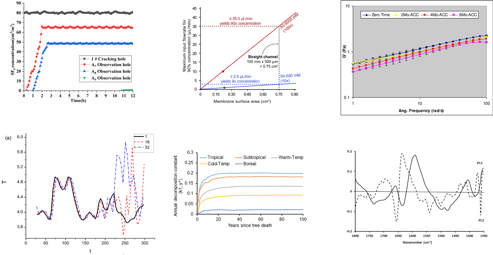
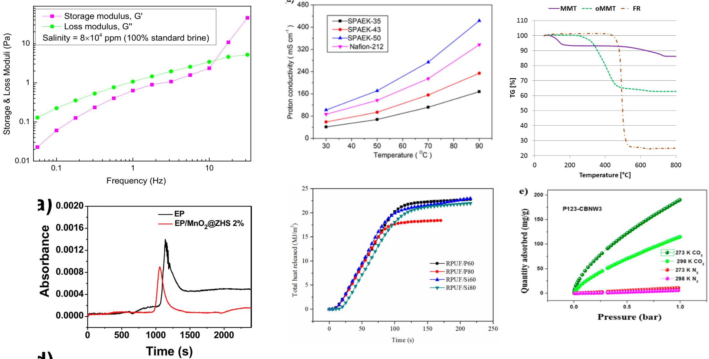

# 1. How Diverse is SciCat?

We believe that the **diversity** of a dataset's design space coverage is the key to making chart data extraction practically useful. 

However, ChartQA, one of the most widely used chart datasets, utilized only about 4 design templates.

### ChartQA Examples

 

To address this issue, we made every effort to expand diversity when designing SciCat.

Now, let's explore examples of the SciCat charts we've collected!

### SciCat Examples

**BMC**

 

**Catalysts**

 

**Frontiers**

 

**Molecules**

 

**Plos**

 

**Polymer**

 

---

**SynCat (synthetic)**

 

**Noisy SynCat (synthetic)** [download link](https://drive.google.com/file/d/1keWQ9wDFrveOsQLbjRO5UhhBnBGnjMZD/view?usp=sharing)

 

**Origin (synthetic)**

 

> [!NOTE]
> SynCat is a synthetic dataset designed to mimic the style of real data while incorporating random stylistic elements.

<!-- origin data will be added -->

# 2. How Reliable is SciCat?

All charts in the SciCat dataset undergo a rigorous validation process. 

After labelers complete their work, we conduct multiple rounds of visualization checks to ensure each component is correctly labeled. The image below demonstrates an example of our visualization process for validation:

 

Through this meticulous process, SciCat delivers reliable annotations, making it a trustworthy resource for scientific chart de-rendering.
